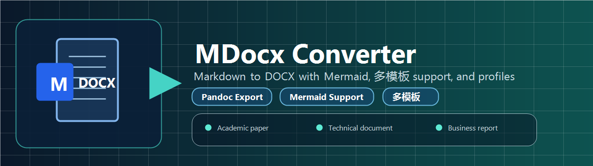
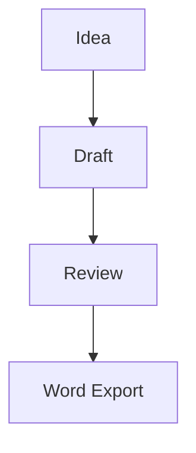
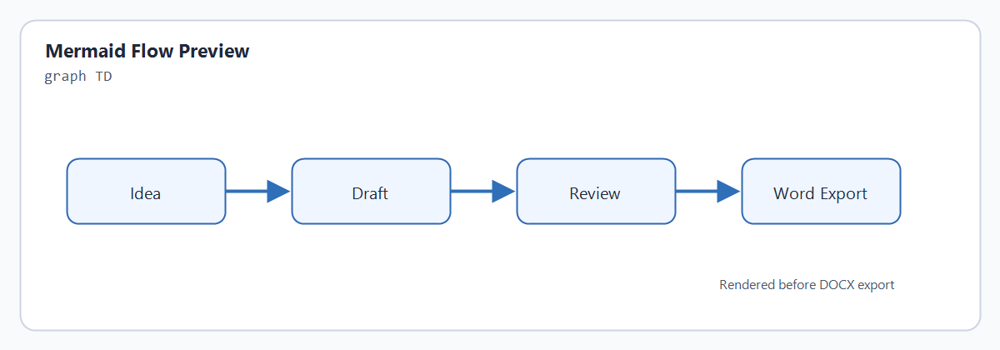

# MDocx Converter



Export Markdown files to DOCX from VS Code with:

- Pandoc-based DOCX generation
- Mermaid code fence rendering
- Built-in English and Chinese multi-template (多模板) reference DOCX files
- Optional custom `reference.docx` template support
- Helpful diagnostics in the output panel

## Features

- Right-click any `.md` file and export it to `.docx`
- Choose a document type at export time: academic paper, technical document, business report, or template default
- Render fenced mermaid diagrams such as:





- Use the bundled English multi-template (多模板) reference DOCX by default
- Switch to the bundled Chinese multi-template (多模板) reference DOCX when needed
- Override with a custom Word template via `reference.docx`
- Keep temporary files when debugging conversion problems

## Requirements

### Required

- `pandoc`

Install examples:

```powershell
winget install --id JohnMacFarlane.Pandoc
```

```bash
brew install pandoc
```

The extension does not bundle Pandoc and does not block installation when Pandoc is missing. It checks for Pandoc when you run `Check Export Environment` or `Export Markdown to DOCX`.

### Required only for Mermaid diagrams

- Mermaid CLI: `mmdc`

## Settings

- `mdocxConverter.pandocPath`
- `mdocxConverter.mermaidCliPath`
- `mdocxConverter.referenceDocx`
- `mdocxConverter.referenceLanguage`
- `mdocxConverter.outputDirectory`
- `mdocxConverter.mermaidOutputFormat`
- `mdocxConverter.openAfterExport`
- `mdocxConverter.keepIntermediateFiles`
- `mdocxConverter.styleProfile`
- `mdocxConverter.bodyFont`
- `mdocxConverter.bodySizePt`
- `mdocxConverter.heading1Font`
- `mdocxConverter.heading1SizePt`
- `mdocxConverter.heading2Font`
- `mdocxConverter.heading2SizePt`
- `mdocxConverter.heading3Font`
- `mdocxConverter.heading3SizePt`
- `mdocxConverter.lineSpacing`
- `mdocxConverter.marginTopMm`
- `mdocxConverter.marginBottomMm`
- `mdocxConverter.marginLeftMm`
- `mdocxConverter.marginRightMm`

Older `paperifyMd.*` settings are still read as a fallback, but new configuration should use `mdocxConverter.*`.

## Style presets

The converter keeps Pandoc and `reference.docx` as the primary DOCX path, then can apply FlexMD-style metadata and DOCX style overrides when you need quick style control.

- `template` / 模板默认: use only the selected reference DOCX
- `academic` / 学术论文: 12 pt body text, 1.5 line spacing, SimSun/SimHei-oriented paper defaults
- `business` / 商务报告: 11 pt body text, 1.25 line spacing, Microsoft YaHei/Arial-oriented report defaults
- `technical` / 技术文档: compact spacing, Arial body text, and Consolas-oriented code styles

Use `Export Markdown to DOCX by Type（MDocx）` from the command palette or Markdown context menu when you want to choose the type for a single export without changing settings.

Use `mdocxConverter.styleProfile` when you want a persistent default:

```json
{
  "mdocxConverter.styleProfile": "business"
}
```

You can still override individual values:

```json
{
  "mdocxConverter.styleProfile": "academic",
  "mdocxConverter.bodyFont": "SimSun",
  "mdocxConverter.bodySizePt": 12,
  "mdocxConverter.heading1Font": "Microsoft YaHei",
  "mdocxConverter.heading1SizePt": 16,
  "mdocxConverter.lineSpacing": 1.5,
  "mdocxConverter.marginTopMm": 25,
  "mdocxConverter.marginBottomMm": 25,
  "mdocxConverter.marginLeftMm": 25,
  "mdocxConverter.marginRightMm": 25
}
```

## Template behavior

`mdocxConverter.referenceLanguage` defaults to `auto`.

- `auto`: detect Markdown content language automatically, choose Chinese template when Chinese is dominant, otherwise English
- `english`: force bundled English multi-template (多模板) reference DOCX
- `chinese`: force bundled Chinese multi-template (多模板) reference DOCX

Reference DOCX resolution order:

1. `mdocxConverter.referenceDocx`, when configured
2. `reference.docx` next to the Markdown file, when present
3. Bundled reference selected by `mdocxConverter.referenceLanguage`

To force the bundled Chinese multi-template (多模板) reference:

```json
{
  "mdocxConverter.referenceLanguage": "chinese"
}
```

To force a specific template:

```json
{
  "mdocxConverter.referenceDocx": "D:\\GitHub\\mdocx-converter\\journal-templates\\reference_chinese_multi_template.docx"
}
```

## Open-after-export behavior

`mdocxConverter.openAfterExport` defaults to `false`.

When enabled:

- On Windows, the extension reveals the exported file in Explorer instead of forcing a shell-open, which avoids frequent "Failed to open: The system cannot find the file (0x2)" pop-up issues.
- On non-Windows systems, it uses the normal external open behavior.

## Development

```bash
npm install
npm run compile
```

Then press `F5` in VS Code to launch an Extension Development Host.

## Quick test

1. Open this folder in VS Code
2. Press `F5`
3. In the Extension Development Host, open `examples/sample.md`
4. Run `Export Markdown to DOCX`
