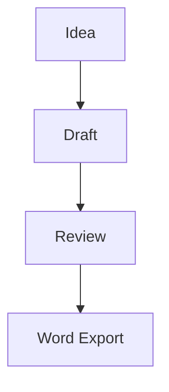

# MDOCX Paper Converter


Export Markdown files to DOCX from VS Code with:

- Pandoc-based DOCX generation
- Mermaid code fence rendering
- Built-in English CSCI and Chinese CSSCI reference DOCX templates
- Optional custom `reference.docx` template support
- Helpful diagnostics in the output panel

## Features

- Right-click any `.md` file and export it to `.docx`
- Render fenced mermaid diagrams such as:




- Use the bundled English CSCI reference DOCX by default
- Switch to the bundled Chinese CSSCI common reference DOCX when needed
- Override with a custom Word template via `reference.docx`
- Keep temporary files when debugging conversion problems

## Requirements

### Required

- `pandoc`

Install examples:

```powershell
winget install --id JohnMacFarlane.Pandoc
```

```bash
brew install pandoc
```

The extension does not bundle Pandoc and does not block installation when Pandoc is missing. It checks for Pandoc when you run `Check Export Environment` or `Export Markdown to DOCX`.

### Required only for Mermaid diagrams

- Mermaid CLI: `mmdc`

## Settings

- `paperifyMd.pandocPath`
- `paperifyMd.mermaidCliPath`
- `paperifyMd.referenceDocx`
- `paperifyMd.referenceLanguage`
- `paperifyMd.outputDirectory`
- `paperifyMd.mermaidOutputFormat`
- `paperifyMd.openAfterExport`
- `paperifyMd.keepIntermediateFiles`

## Template behavior

`paperifyMd.referenceLanguage` defaults to `auto`.

- `auto`: detect Markdown content language automatically, choose Chinese template when Chinese is dominant, otherwise English
- `english`: force bundled English CSCI reference DOCX
- `chinese`: force bundled Chinese CSSCI reference DOCX

Reference DOCX resolution order:

1. `paperifyMd.referenceDocx`, when configured
2. `reference.docx` next to the Markdown file, when present
3. Bundled reference selected by `paperifyMd.referenceLanguage`

To force the bundled Chinese CSSCI common reference:

```json
{
  "paperifyMd.referenceLanguage": "chinese"
}
```

To force a specific template:

```json
{
  "paperifyMd.referenceDocx": "D:\\GitHub\\md-docx-mermaid-exporter\\journal-templates\\reference_cssci_三刊通用.docx"
}
```

## Open-after-export behavior

`paperifyMd.openAfterExport` defaults to `false`.

When enabled:

- On Windows, the extension reveals the exported file in Explorer instead of forcing a shell-open, which avoids frequent "Failed to open: The system cannot find the file (0x2)" pop-up issues.
- On non-Windows systems, it uses the normal external open behavior.

## Development

```bash
npm install
npm run compile
```

Then press `F5` in VS Code to launch an Extension Development Host.

## Quick test

1. Open this folder in VS Code
2. Press `F5`
3. In the Extension Development Host, open `examples/sample.md`
4. Run `Export Markdown to DOCX`
